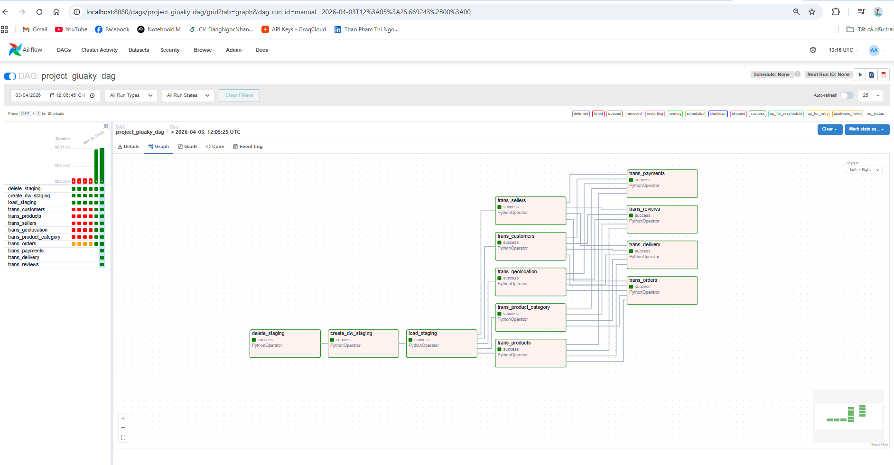
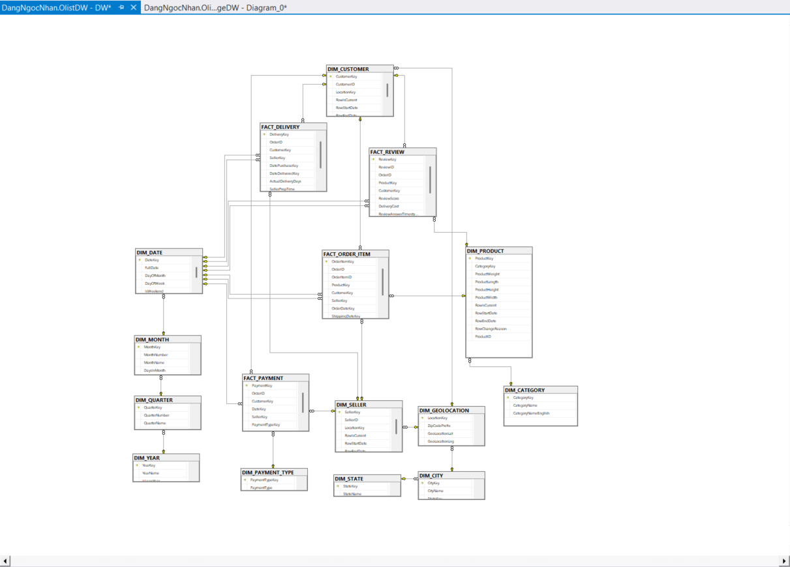
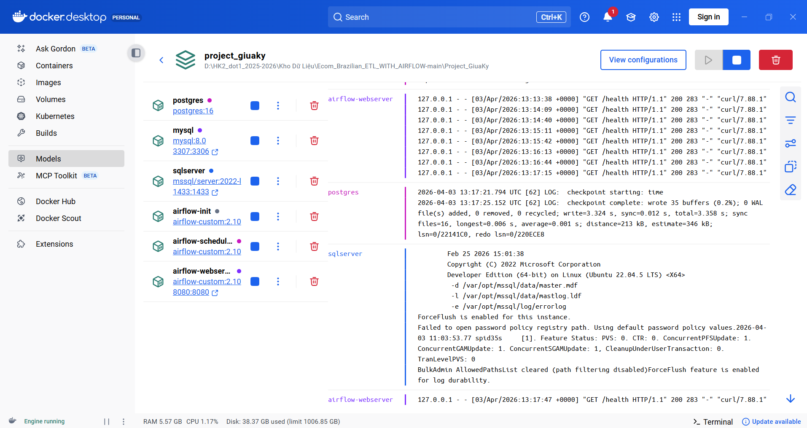

# 🚀 Olist Brazilian E-Commerce: End-to-End ETL & Data Warehouse Pipeline

[](https://airflow.apache.org/)
[](https://www.docker.com/)
[](https://www.microsoft.com/sql-server/)
[](https://www.python.org/)

Hệ thống xử lý dữ liệu tự động hóa hoàn toàn, tích hợp luồng dữ liệu từ nguồn thô (CSV) qua Staging (MySQL) đến kho lưu trữ tập trung (Data Warehouse) trên SQL Server theo mô hình **Star Schema**.

---

## 📺 Project Overview


*Hình 1: Pipeline ETL hoàn chỉnh với 12 Tasks chạy song song tối ưu hiệu suất*

Dự án này giải quyết bài toán quản trị dữ liệu quy mô lớn của bộ dữ liệu thương mại điện tử Brazil (Olist), cung cấp cái nhìn sâu sắc về doanh thu, logistics và sự hài lòng của khách hàng.

---

## 🏗️ Technical Architecture

Hệ thống được thiết kế theo kiến trúc **Medallion-inspired Architecture**:

1.  **Bronze (Staging)**: MySQL nạp dữ liệu thô từ CSV không qua xử lý.
2.  **Gold (Warehouse)**: MS SQL Server lưu trữ dữ liệu đã làm sạch và chuyển hóa (Refined Data).

| Component | Technology | Role |
| :--- | :--- | :--- |
| **Orchestrator** | Apache Airflow | Lập lịch, điều phối và giám sát lỗi. |
| **Logic Engine** | Python (Pandas) | Xử lý làm sạch, định dạng ngày tháng và SCD Type 2. |
| **Storage (DW)** | MS SQL Server | Lưu trữ kho dữ liệu trung tâm tối ưu cho BI/Analytics. |
| **Infrastructure**| Docker Compose | Đảm bảo môi trường chạy giống nhau 100% trên mọi máy tính. |

---

## 🧩 Data Warehouse Design (Star Schema)

Mô hình dữ liệu được thiết kế tối ưu với **4 bảng FACT** và **6 bảng DIM** chính, giúp việc truy vấn báo cáo cực kỳ linh hoạt:


*Hình 2: Sơ đồ thực thể liên kết (ERID) chuyên nghiệp cho Data Warehouse*

### ✅ Key Fact Tables:
*   **`FACT_ORDER_ITEM`**: Phân tích doanh số sản phẩm và chi phí vận chuyển.
*   **`FACT_PAYMENT`**: Phân tích hành vi thanh toán (Trả góp, Loại thẻ).
*   **`FACT_DELIVERY`**: Đánh giá hiệu suất Logistics (Thời gian thực so với dự kiến).
*   **`FACT_REVIEW`**: Đo lường trải nghiệm khách hàng (CSAT, Feedback).

### ✅ Slowly Changing Dimensions (SCD Type 2):
*   Hệ thống hỗ trợ theo dõi lịch sử thay đổi của **Sellers**, **Products**, và **Customers** cho phép báo cáo thay đổi theo thời gian.

---

## ⚙️ Automated Pipeline Workflow

Hệ thống hạ tầng được quản lý tập trung và tự động hóa 100%:


*Hình 3: Toàn bộ dịch vụ vận hành ổn định trên nền tảng Docker*

1.  **Auto Initialization**: Đọc file `scriptDW.sql` để tự động xây dựng cơ sở hạ tầng bảng biểu.
2.  **Parallel Fact Loading**: 4 bảng FACT quan trọng bản nhất nạp đồng thời, tận dụng tối đa sức mạnh của hệ thống.
3.  **Error Handling**: Tích hợp cơ chế Re-try và ghi log chi tiết cho từng Task.

---

## 🛠️ Getting Started

### 1. Prerequisites
*   Docker Desktop installed.
*   Olist dataset (.csv files) placed in `/dataset`.

### 2. Launching
```powershell
docker-compose up -d --build
```
Truy cập `http://localhost:8080` (Airflow), đăng nhập `airflow/airflow`, bật và chạy DAG **`project_giuaky_dag`**.

---

## 📈 Key Metrics & Insights (KPIs)
*   **Fulfillment Speed**: Đo lường năng lực chuẩn bị hàng của Seller.
*   **Delivery Reliability**: Tỉ lệ giao hàng đúng hạn (On-time Delivery Rate).
*   **Customer Loyalty**: Phân tích giá trị trọn đời của khách hàng.
*   **Payment Optimization**: Tỉ lệ thanh toán thành công theo từng phương thức.

---
🚀 *Dự án được thực hiện bởi: [Tên của bạn]*
